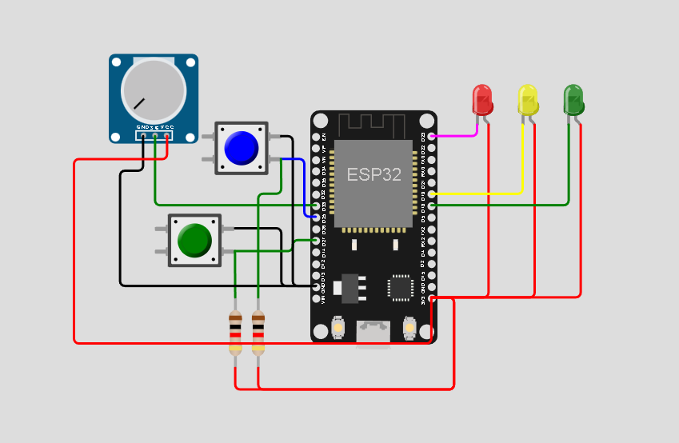
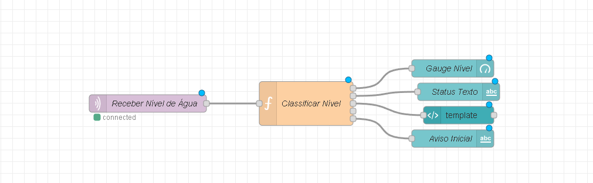
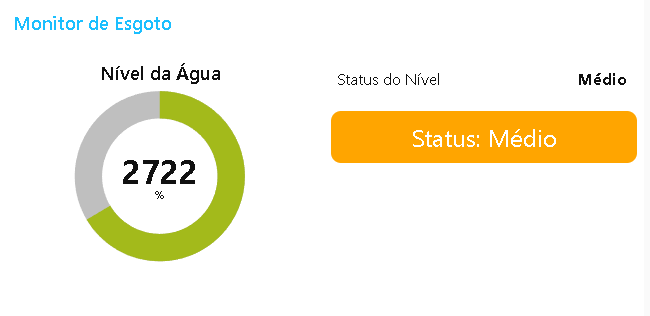

🌍 [Leia em Português](README.pt-BR.md)

# Disaster Pulse IoT

This project consists of an intelligent sewage level monitoring system, using sensors connected via MQTT and displaying the data in a dynamic panel in Node-RED. It is ideal for disaster prevention in urban and sanitation environments.

## Visual Demo

- Wokwi (Circuit Simulator)



---

- Node-RED Panel



---

- Dashboard



## Technologies Used

- `Wokwi` – Hardware simulation (ESP32 + Level Sensor)
- `ESP32` – Development board
- `Sensor` Ultrasonic – Water level measurement
- `Node-RED` – Graphical interface for data display
- `MQTT (HiveMQ)` – Lightweight communication protocol
- `JavaScript (Node-RED Function Node)` – Data processing and classification
- `Dashboard Node-RED` – User-friendly real-time data visualization

## Functioning

### 1. Data Collection (Wokwi)

The ultrasonic sensor (HC-SR04) measures the distance of the water and sends the data via MQTT via the Water/Sewage Level topic
and the ESP32 code converts the sensor values to a comprehensible format and publishes them at time intervals.

### 2. Processing in Node-RED

The flow in Node-RED performs:

Level rating as Low, Medium or High

### 3. Graphical Interface

The Node-RED panel displays:

- Gauge Donut with current value (0-4095)

- Status of the textual level

- Colorful alert block: red (low), orange (medium), green (high)

- Graph with the last records

## Classification Logic (Level)

- Level <= 1500 → 🔴 Low
- Level between 1501 – 3000 → 🟠 Medium
- Level > 3000 → 🟢 High

## 🌐 Broker MQTT Used

- Public broker: broker.hivemq.com
- Port: 1883
- Topic used: NivelAgua/Esgoto

## 📈 Visual Output Example

 Insert here a print of the chart over time with visible oscillations.

## Steps to run

1. Open the project in [Wokwi](https://wokwi.com/projects/432230740712253441) and upload the code to ESP32 or run on wokwi.

2. Install Node-RED

```bash
npm install - g node-red
```

3. Import the [flow](./flow.json) file into Node-RED.

4. Run flow.

5. Access the dashboard in <http://localhost:1880/ui>

## Team

- Felipe Gabriel Lopes Pinheiro Clarindo -> RM: 554547
- Humberto de Souza Silva -> RM: 558482
- Andre Geraldi Marcolongo -> RM: 555285

## License

This project is licensed under the [GNU Affero License](https://www.gnu.org/licenses/agpl-3.0.html).
