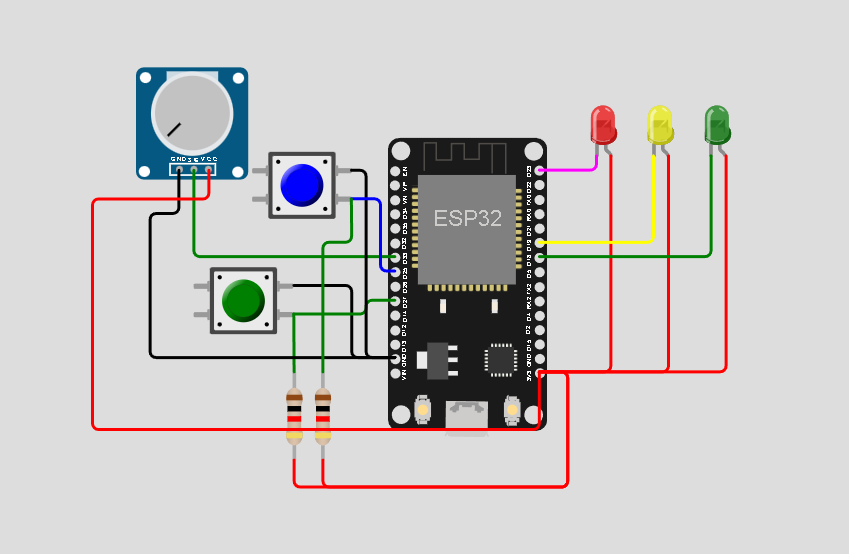
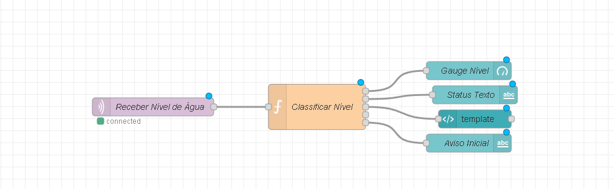
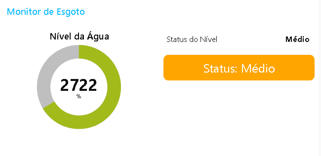

🌍 [Read in English](README.md)

# Disaster Pulse IoT

Este projeto consiste em um sistema inteligente de monitoramento de nível de água de esgoto, utilizando sensores conectados via MQTT e exibindo os dados em um painel dinâmico no Node-RED. É ideal para prevenção de desastres em ambientes urbanos e de saneamento.

## 📷 Demonstração Visual

- Wokwi (Simulador de Circuito)



---

- Painel Node-RED



---

- Dashboard



## Tecnologias Utilizadas

- `Wokwi` – Simulação do hardware (ESP32 + Sensor de Nível)
- `ESP32` – Placa de desenvolvimento
- `Sensor` Ultrassônico – Medição de nível de água
- `Node-RED` – Interface gráfica para exibição dos dados
- `MQTT (HiveMQ)` – Protocolo de comunicação leve
- `JavaScript (Node-RED Function Node)` – Processamento e classificação dos dados
- `Dashboard Node-RED` – Visualização amigável dos dados em tempo real

## Funcionamento

### 1. Coleta de Dados (Wokwi)

O sensor ultrassônico (HC-SR04) mede a distância da água e envia os dados via MQTT através do tópico NivelAgua/Esgoto
e o código da ESP32 converte os valores do sensor para um formato compreensível e os publica em intervalos de tempo.

### 2. Processamento no Node-RED

O fluxo no Node-RED realiza:

Classificação do nível como Baixo, Médio ou Alto

### 3. Interface Gráfica

O painel do Node-RED exibe:

- Gauge Donut com o valor atual (0-4095)

- Status do nível textual

- Bloco de alerta colorido: vermelho (baixo), laranja (médio), verde (alto)

- Gráfico com os últimos registros

## Lógica de Classificação (Nível)

Nivel <= 1500 → 🔴 Baixo

Nivel entre 1501 – 3000 → 🟠 Médio

Nivel > 3000 → 🟢 Alto

## Broker MQTT Utilizado

Broker público: broker.hivemq.com

Porta: 1883

Tópico utilizado: NivelAgua/Esgoto

## Passos para Executar

1. Abra o projeto no [Wokwi](https://wokwi.com/projects/432230740712253441) e carregue o código para a ESP32 ou execute no wokwi.

2. Instale o Node-RED

```bash
npm install -g node-red
```

3. Import o arquivo [flow](./flow.json) para o Node-RED.

4. Execute o fluxo.

5. Acesse o dashboard em <http://localhost:1880/ui>

## Equipe

- Felipe Gabriel Lopes Pinheiro Clarindo   ->   RM: 554547
- Humberto de Souza Silva                  ->   RM: 558482
- André Geraldi Marcolongo                 ->   RM: 555285

## Licença

Este projeto está licenciado sob a [GNU Affero License](https://www.gnu.org/licenses/agpl-3.0.html).
